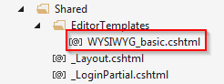

In a [previous post](https://mike.barram.dev/blog/2014/multiline-text-editor-in-mvc) I showed how you could set attributes on properties in an MVC model so that a text field would be edited with a multi-line HTML text box, instead of a single line input field.

What if the you text you’re editing is HTML and you want to use an HTML editor? In the edit razor view, you could set some HTML attributes (e.g. CSS class) on the @Html.EditorFor() but you would have to do that on every view where you edit the field, and on every field that you want to use an HTML editor for. So this shows how to add an attribute to a property so that, wherever the property is edited, the HTML editor will be used.

Just as in the previous post, you add an attribute to a meta data class. To edit a text field with a multi-line text box you had these attributes:

```C#
[AllowHtml]
[DataType(DataType.MultilineText)]
public string htmlField { get; set; }
```

So for a WYSIWYG editor you can add a UI hint:

```C#
[UIHint("WYSIWYG_basic"), AllowHtml]
public string htmlField { get; set; }
```

That UI hint tells MVC to look for a custom editor template for that property. In this case the editor should be called \\Views\\Shared\\EditorTemplates\\WYSIWYG\_basic.cshtml

[](images/UIhint.png)

In this case, the editor template is simply:

```C#
@Html.TextArea("", new { @class = "wysiwyg basic" })
```

This means that the property will be edited with a text area that has the classes wysiwyg and basic

I then installed the nuget package TinyMCE.jQuery

In the \_layout view, I told TinyMCE to convert anything with a class of “wysiwyg” to a TinyMCE editor:

You also have to remember to reference the TinyMCE javascript library. I did that by creating a bundle in App\_Start\\BundleConfig.cs

```C#
    bundles.Add(new ScriptBundle("~/bundles/tinymce").Include(
        "~/Scripts/tinymce/tinymce.min.js"));
```

And then adding that bundle in the \_layout view:

```C#
 @Scripts.Render("~/bundles/tinymce")
```
