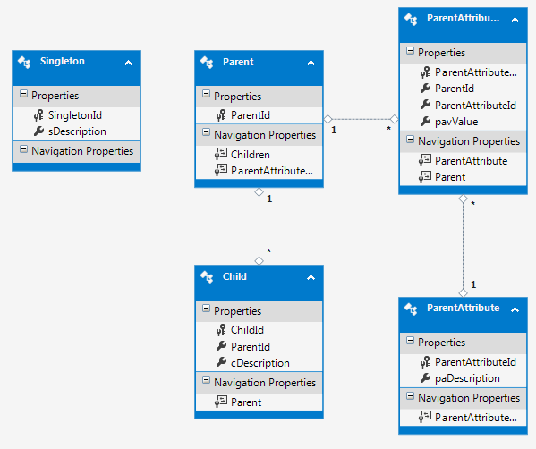
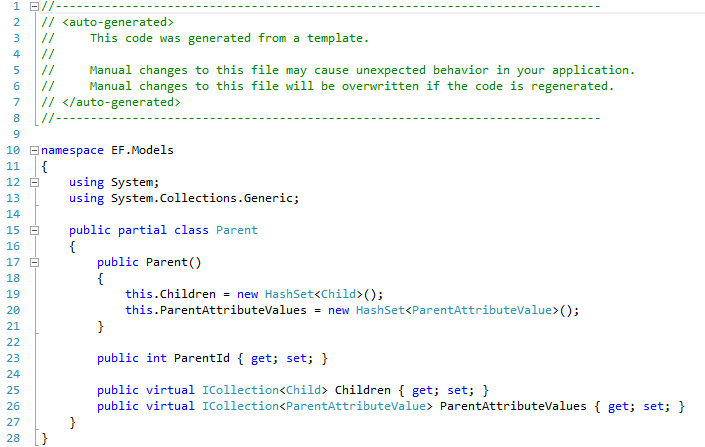
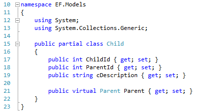
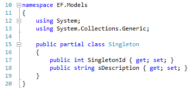
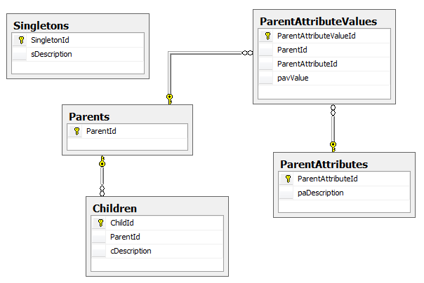

There are 3 ways to link entity framework to a database:

1. **Database first**. Point Visual Studio at your database and it will create an entity model for you.
2. **Code first**. Write your classes in Visual Studio and it can create your database for you.
3. **Model first**. Use the Entity Data Model Tool in Visual Studio to model your entities. Visual Studio will can them create your database and classes for you.

I’ve just tried **Model First** and not achieved what I wanted.

**What did work:**

- Following the instructions in [this video](http://msdn.microsoft.com/en-us/data/gg702906 " Building an MVC 3 App with Model First and Entity Framework 4.1") I created a model, which looked similar to a database diagram.
- I then automatically generated a database from the model. At the same time, classes were created.
- I could update the model and then recreate the database.

**What didn’t work:**

Being able to modify the database after changing the model. If the tables contain data, I would want Visual Studio to create the scripts to alter tables, rather than drop and re-create them. Model first doesn’t let you create a migration script.

This http://www.nuget.org/packages/CodeSecond might help with doing that.

This problem is described here http://stackoverflow.com/questions/15014705/how-to-manage-entity-framework-model-first-schema-updates, so perhaps you need a tool like http://www.devart.com/entitydeveloper/product-tour.html

Or, I could use code first instead…

**The generated classes**

[]

The same entities as Simon’s model but created using the Entity Data Model Tool

[]

Generated Parent class

[]

Generated Child class

[]

Generated Singleton class

Parent uses ```ICollection<Child>``` instead of ```List<Child>``` 

Also, when a new Parent is initialised, the class creates new HashSets of related entities.

Just to show that model first can create a database – here it is:

[]

Database generated from the model, looking just like the one Simon generated from code

Perhaps, if you really don’t like writing classes (I’d prefer to use a visual designer), you could use model first to create the code for the classes and then copy those classes into a project that uses code first…

Another alternative would be to use model first but when you want to make changes to the database, make those changes in the database and then tell the model to update itself.

Useful documentation:

[Entity Framework (EF) Documentation](http://msdn.microsoft.com/en-gb/data/ee712907.aspx)

http://stackoverflow.com/questions/5446316/code-first-vs-model-database-first
