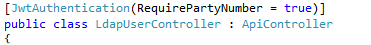

In my previous post on [avoiding monolithic applications](https://mikebarram.wordpress.com/2015/04/10/avoiding-monolithic-applications/), I mentioned that JSON Web Tokens and CORS could be used to access protected web apis on other sites. Here’s the why and how.

## The requirement for accessing protected web apis on other sites

Ideally (my ideal), each application that is developed would be relatively compact and include only the functionality that is unique to that application. Functionality from other applications would be provided by APIs in those applications and generic functionality (e.g. a staff lookup) would be provided by an application (or multiple) that all other applications can access (almost like  a CDN for functionality).

## The technical difficulties

If the API is public and requires no authentication, there are few difficulties and you would typically get the client (JavaScript in the browser) to access the 3rd party API.

It’s more difficult if the API requires authentication. The client could sent their username and password with every request with every request and in some situations that works (e.g. XML-RPC requests in WordPress). In the University of Manchester, authentication doesn’t happen in the individual applications (instead we use [CAS](http://jasig.github.io/cas/)), so we don’t want passwords to be sent to anything other than the CAS server.

There is also the problem that browsers by default block cross-domain resource sharing (e.g. AJAX requests) to protect the user from cross-site scripting attacks.

## The solutions

As you may have guessed from the title of this article, the solutions are [JSON Web Tokens](http://jwt.io/) (JWT) and [Cross-origin resource sharing](http://en.wikipedia.org/wiki/Cross-origin_resource_sharing) (CORS)

JWT is apparently prononced “jot”, possibly because JSON Web Tokens are a JSON version of [Simple Web Tokens](https://msdn.microsoft.com/en-us/library/azure/hh781551.aspx) (SWT), which were pronounced “swot”

If a page in Site A wants to access a resource in site B then Site A, which the user has authenticated with, can provide a token to the client that can then be sent in the request to Site B. Site B can then validate that token and then be able to trust that the user is who Site A says they are. To make sure the client can’t pretend to be someone else, the token is encrypted by Site A with a key, so that the client only sees the encrypted token. Site B has the same key, so can decrypt the token and see who the user is. This is best [explanation of JWT](http://angular-tips.com/blog/2014/05/json-web-tokens-introduction/) that I’ve found – I like the hotel room card analogy.

If the token contains information such as Staff Id, then JWT will work especially well within an institution, as both the site that creates the token and the site that receives it will have an understanding of the identifier. An extra benefit of encrypted tokens is the low overhead to the receiving service – it doesn’t need to validate the token – no database lookups or checks with the originating server.

Creating the token was easy. I used Nuget to install the [JWT package](https://github.com/johnsheehan/jwt) and created a class for a JWT claim and a function to convert a user into a claim:

Microsoft has a Nuget to provide a different [library for encoding/decoding JSON Web Tokens](https://www.nuget.org/packages/System.IdentityModel.Tokens.Jwt/). They’re both pretty bad at providing usable examples – the one I used was the one I happened to get to work.

I can then create a very simple Web API that requires the user to be authenticated (the \[Authorize\] attribute does this) and returns the token:

The JavaScript in my (single page) application gets the token and stores it for use later on:

This is the point, later on, where I want to call a method from another application. The token is added to the request header as is the Access-Control-Allow-Origin parameter, which is to keep CORS happy:

On the server receiving the request, I have the same class:

And I have some functions to read the token from the request header and convert it to a JwtClaim:

Then I have a custom attribute filter, which, if applied to a controller class or individual method, will check the token and, optionally, check the properties of the token:

Here’s that attribute filter being applied to all of the methods in a controller class. In this case I don’t just want a token, I want the user to have a PartyNumber:

To solve the problem of cross-domain resource sharing, the application needs to be configured to accept CORS requests. The easiest way is in the web.config but there are fancier ways to set these custom headers, so that they are only sent in response to certain requests or to only allow origins that are in a white-list:

The way that CORS works is that:

- The browser recognises that it is being asked to make a cross-domain request.
- It doesn’t want to send a potentially sensitive/dangerous request straight off.
- Instead, it sends a tentative “OPTIONS” request (rather than GET, POST etc.) to the same URL.
- The server then sends back an empty response saying what information it will accept (the custom headers in the web.config)
- The browser then sends the request, including the custom headers, especially the token.

Some of the articles listed below go into more detail. I’d highly recommend watching the traffic using [Fiddler](http://www.telerik.com/fiddler).

A simple way to get the server to send an empty (except for the headers) response to all OPTIONS requests is to add this to the global.asax:

## Problems / Improvements to be made

One thing that you will notice using JWT with CORS is that every single requests requires a “pre-flight” OPTIONS request (you don’t programme these, the browser just makes them). The reason the response to the first options request isn’t cached is because the request contains a custom header – the token. It does mean that you’re doubling the number of requests across the network but, within the University, the options request is only taking 5 milliseconds. This may be more of a concern for mobile users for whom network latency is higher.

The code above is pretty rough and ready – you’d certainly want to make it more robust.

Having the token expire when the user is still making requests from their SPA is a problem. The responseInterceptor code here shows how you can trap for that and get a fresh token (you’d want to do this whether the request was cross-domain or not).

## Useful articles

JWT

- http://angular-tips.com/blog/2014/05/json-web-tokens-introduction/
- http://jwt.io/
- https://auth0.com/blog/2014/01/07/angularjs-authentication-with-cookies-vs-token/
- http://engineering.talis.com/articles/elegant-api-auth-angular-js/

CORS

- http://www.html5rocks.com/en/tutorials/cors/
- http://www.asp.net/web-api/overview/security/enabling-cross-origin-requests-in-web-api
- https://dlr2008.wordpress.com/2014/01/16/poor-mans-delegation-web-api-version-2-cors-and-system-identitymodel-tokens-jwt-part-2/
- https://aspnetwebstack.codeplex.com/discussions/467315
- http://stackoverflow.com/questions/12013216/how-to-apply-cors-preflight-cache-to-an-entire-domain